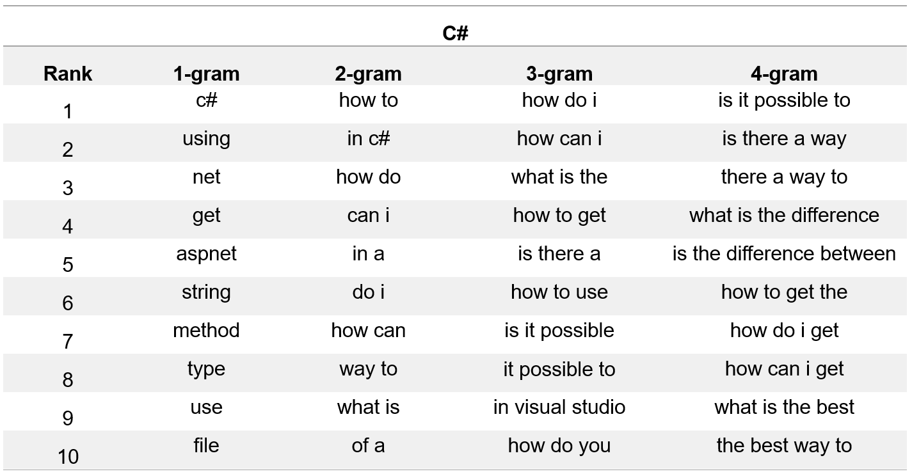

# “Automated Question Title Reformulation by Mining Modification Logs From Stack Overflow” 
## Introduction

Our pretrained model [QETRA](https://archive.org/download/stackexchange) has released on huggingface. 

## DataSet

We gathered modification logs from two large-scale data dumps from [Stack Overflow](https://archive.org/download/stackexchange), accessed in March 2022.
In our dataset,  we identified 122,528 title reformulation threads. From these threads, we extracted a total of 152,259 title reformulation pairs.
We split the dataset into the training set, the validation set, and the testing set in a ratio of 80\%, 10\%, and 10\%.
The details of statistical information for different programming languages can be found in Table.

## DataSet

## Chrome plugin

## Question title content analysis

