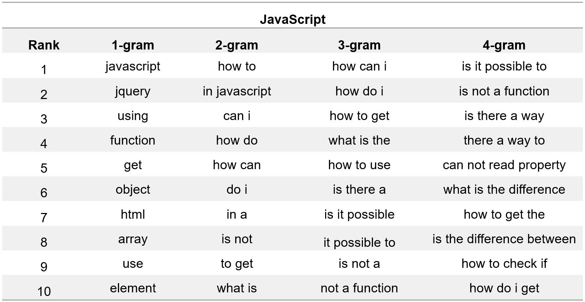

# “Automated Question Title Reformulation by Mining Modification Logs From Stack Overflow” 
## Introduction

Writing a high-quality title that clarifies and summarizes the critical problems in the post is a challenging task for developers, especially for novices who lack domain knowledge or poor writing skills.
Therefore, we first conducted an informative study to investigate the title reformulation patterns by mining modification logs provided by Stack Overflow.
Motivated by the above findings, we propose a novel approach QETRA based on the pre-trained model T5 and multi-task learning and a plug-in to facilitate the use of developers.
Based on our gathered datasets, we evaluate the effectiveness of QETRA by both automatic evaluation and human study. Finally, we also verify the generalization of QETRA for posts related to other new programming languages and the challenging types of question title reformulation for QETRA.
For detailed information please refer to our paper.
Our trained model [QETRA](https://archive.org/download/stackexchange) has released on huggingface. 

## DataSet

We gathered modification logs from two large-scale data dumps from [Stack Overflow](https://archive.org/download/stackexchange), accessed in March 2022.
In our dataset,  we identified 122,528 title reformulation threads. From these threads, we extracted a total of 152,259 title reformulation pairs.
We split the dataset into the training set, the validation set, and the testing set in a ratio of 80\%, 10\%, and 10\%.
The details of statistical information for different programming languages can be found in Table.

## The Result Of Question title content analysis

## Result
This table show the performance of QETRA and baselines in terms of all the evaluation metrics for different programming languages. 

## Results of the Wilcoxon signed-rank test

![image][align=c](figs/LanguageTool_P.png)

## Chrome plugin

To make our proposed approach more practical, we developed a browser plugin based on QETRA and integrated it into the Chrome browser. 
The screenshot of our developed tool is shown in figure above. 
When a user is editing a question post, the browser plugin will automatically analyze the original title and body of the question post, and recommend the top-5 reformulation titles to the users for selection. 

Instructions for use:

1.Download and install the plugin from the ReTitlePlugin folder
2.Edit your question post.
3.Press Ctrl + Q to get reformulated titles

